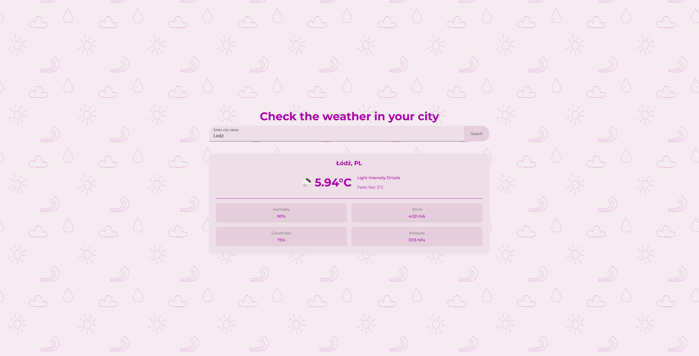

# 🌦️ Full-Stack Weather App

> A clean, responsive weather application built with an Angular frontend and a custom Python/Flask backend. This app provides real-time weather data, a 5-city autocomplete search, and a custom-designed UI.

## 🚀 Live Preview



---

## ✨ Features

* **Real-Time Weather Data:** Fetches current temperature, "feels like," humidity, wind speed, and more.
* **Autocomplete City Search:** A dynamic search bar that suggests cities as you type (using a custom backend endpoint).
* **Toast Error Handling:** Shows non-disruptive "toast" notifications for errors (e.g., "City not found").
* **Responsive Design:** Looks great on both desktop and mobile.

---

## 💻 Tech Stack

* **Frontend:** Angular, TypeScript, Angular Material, CSS
* **Backend:** Python, Flask (for the REST API)
* **API:** OpenWeatherMap (for both weather and geocoding data)

---

## 🔗 Backend API

This project is decoupled and requires its own backend to run. You can find the Python/Flask API code in its separate repository:

**[github.com/maksymiliankoscielniak/python-weather-app](https://github.com/maksymiliankoscielniak/python-weather-app)**

---

## 🏃‍♀️ How to Run

To run this project, you need to have **both** the backend and frontend servers running.

### 1. Run the Backend

```bash
# Clone the backend repo
git clone [https://github.com/maksymiliankoscielniak/python-weather-app.git](https://github.com/maksymiliankoscielniak/python-weather-app.git)
cd python-weather-app

# Set up and activate virtual environment
python -m venv venv
source venv/bin/activate  # (or .\venv\Scripts\activate on Windows)

# Install dependencies
pip install -r requirements.txt

# Run the server
python app.py
```

### 2. Run the Frontend

```bash
# In a new terminal, clone this repo
git clone [https://github.com/maksymiliankoscielniak/weather-app-frontend.git](https://github.com/maksymiliankoscielniak/weather-app-frontend.git)
cd weather-app-frontend

# Install dependencies
npm install

# Run the server
ng serve
```

Once both servers are running, open your browser to http://localhost:4200/.
